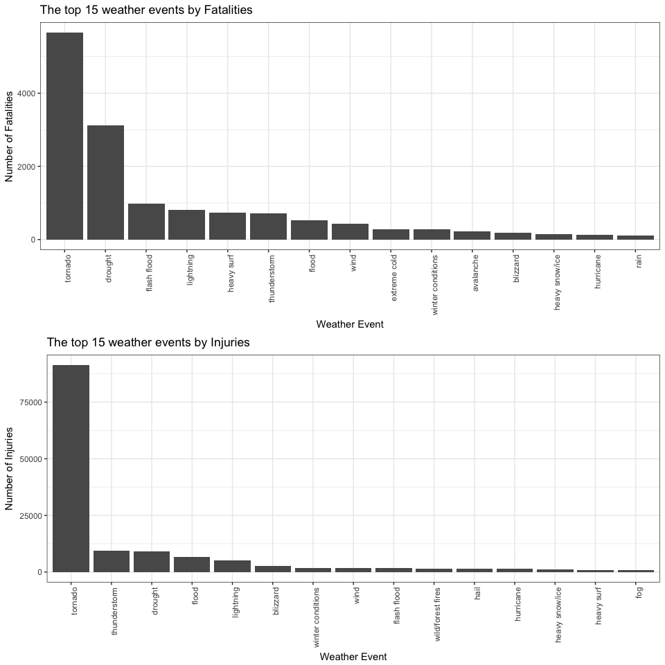
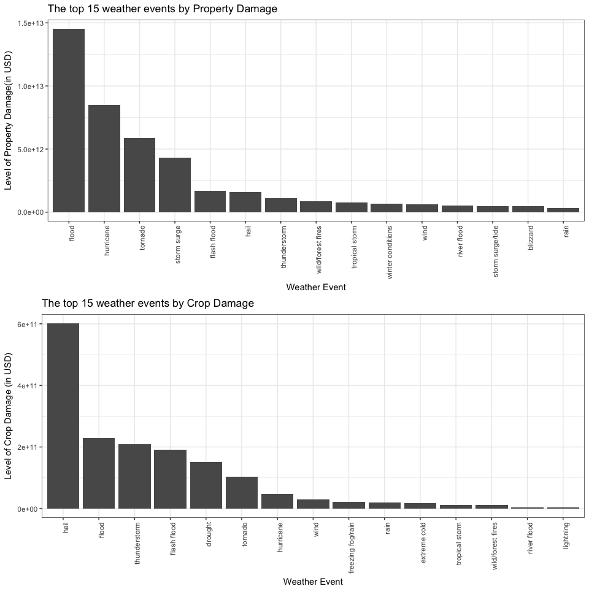

The Impact of Severe Weather Events on Public Health and Economic Issues
===================================================================================================


Synopsis
==========
Storms and other severe weather events can cause both public health and economic problems for communities and municipalities. Many severe events can result in fatalities, injuries, and property damage, and preventing such outcomes to the extent possible is a key concern.

This project involves exploring the U.S. National Oceanic and Atmospheric Administration's (NOAA) storm database. This database tracks characteristics of major storms and weather events in the United States, including when and where they occur, as well as estimates of any fatalities, injuries, and property damage.

A. Across the United States, which types of events (as indicated in the 𝙴𝚅𝚃𝚈𝙿𝙴 variable) are most harmful with respect to population health?
B. Across the United States, which types of events have the greatest economic consequences?


Data Processing : Load Libraries, Enable Global Settings, Read Data, Data Selection
========================================================================================


```r
echo = TRUE  # Always make code visible


library(ggplot2)
library(plyr)
library(lubridate) ## to change to date formate
```

```
## 
## Attaching package: 'lubridate'
```

```
## The following object is masked from 'package:plyr':
## 
##     here
```

```
## The following object is masked from 'package:base':
## 
##     date
```

```r
library(data.table) ## to replace readble column names
```

```
## 
## Attaching package: 'data.table'
```

```
## The following objects are masked from 'package:lubridate':
## 
##     hour, isoweek, mday, minute, month, quarter, second, wday,
##     week, yday, year
```

```r
suppressWarnings(suppressMessages(library(R.utils)))
suppressWarnings(suppressMessages(require(gridExtra)))


datafile <-"repdata-data-StormData.csv"
if(!file.exists(datafile)){
    tmp <- tempfile()
    download.file("https://d396qusza40orc.cloudfront.net/repdata%2Fdata%2FStormData.csv.bz2",tmp)
    bunzip2(tmp,dest,overwrite=TRUE, remove=FALSE)
    unlink(tmp)
}

#read the stormdata file


Storm <- read.csv(datafile,header=TRUE)
```

Get a feel of the csv file

```r
dimension <- dim(Storm)

head(Storm)
```

```
##   STATE__           BGN_DATE BGN_TIME TIME_ZONE COUNTY COUNTYNAME STATE
## 1       1  4/18/1950 0:00:00     0130       CST     97     MOBILE    AL
## 2       1  4/18/1950 0:00:00     0145       CST      3    BALDWIN    AL
## 3       1  2/20/1951 0:00:00     1600       CST     57    FAYETTE    AL
## 4       1   6/8/1951 0:00:00     0900       CST     89    MADISON    AL
## 5       1 11/15/1951 0:00:00     1500       CST     43    CULLMAN    AL
## 6       1 11/15/1951 0:00:00     2000       CST     77 LAUDERDALE    AL
##    EVTYPE BGN_RANGE BGN_AZI BGN_LOCATI END_DATE END_TIME COUNTY_END
## 1 TORNADO         0                                               0
## 2 TORNADO         0                                               0
## 3 TORNADO         0                                               0
## 4 TORNADO         0                                               0
## 5 TORNADO         0                                               0
## 6 TORNADO         0                                               0
##   COUNTYENDN END_RANGE END_AZI END_LOCATI LENGTH WIDTH F MAG FATALITIES
## 1         NA         0                      14.0   100 3   0          0
## 2         NA         0                       2.0   150 2   0          0
## 3         NA         0                       0.1   123 2   0          0
## 4         NA         0                       0.0   100 2   0          0
## 5         NA         0                       0.0   150 2   0          0
## 6         NA         0                       1.5   177 2   0          0
##   INJURIES PROPDMG PROPDMGEXP CROPDMG CROPDMGEXP WFO STATEOFFIC ZONENAMES
## 1       15    25.0          K       0                                    
## 2        0     2.5          K       0                                    
## 3        2    25.0          K       0                                    
## 4        2     2.5          K       0                                    
## 5        2     2.5          K       0                                    
## 6        6     2.5          K       0                                    
##   LATITUDE LONGITUDE LATITUDE_E LONGITUDE_ REMARKS REFNUM
## 1     3040      8812       3051       8806              1
## 2     3042      8755          0          0              2
## 3     3340      8742          0          0              3
## 4     3458      8626          0          0              4
## 5     3412      8642          0          0              5
## 6     3450      8748          0          0              6
```

```r
colnames <- names(Storm)
```
The data has dimensions 902297, 37.

To answer the questions, I need the following variables:
* BGN_DATE = date
* EVTYPE = weatherevent
* FATALITIES = fatalities
* INJURIES = injuries
* PROPDMG = propertydamage
* PROPDMGEXP = propertydamage x exponent
* CROPDMG = cropdamage
* CROPDMGEXP = cropdamage x exponent 


Data Processing : Data-Cleanup
===================================

* convert date into date format
* Convert titles to be more readable
* convert exponent
    + k/K = 1000
    + b/B = 1,000,000,000
    + m/M = 1,000,000
    + Others = 0
* weatherevent has too much variability in the reporting
    + homogenize the vocab used 
    + adjectives : extreme, non, prolonged, unusual, winter, warm, dry, cold
    + events : flood, lightning, rain, rip current, storm, tornado, thunderstorm,  blizzard ...
 

```r
Storm$BGN_DATE <- mdy_hms(Storm$BGN_DATE)

desiredcol <- c("BGN_DATE","EVTYPE","FATALITIES","INJURIES","PROPDMG","PROPDMGEXP","CROPDMG","CROPDMGEXP")
Storm2 <- Storm[desiredcol]

setnames(Storm2, old=c("BGN_DATE","EVTYPE","FATALITIES","INJURIES","PROPDMG","PROPDMGEXP","CROPDMG","CROPDMGEXP"), new=c("date", "weatherevent","fatalities","injuries","propertydamage","propertydamageXexp","cropdamage","cropdamageXexp"))

Storm2$propertydamageXexp2 <- Storm2$propertydamageXexp
Storm2$propertydamageXexp2 <- revalue(Storm2$propertydamageXexp2,c("K"="3","M"="6","m"="6","B"="9","+"="0","h"="2","H"="2","-"="0","?"="0"))
Storm2$propertydamageXexp2[Storm2$propertydamageXexp2==""] <- "0"
Storm2$propertydamageXexp2 <- as.numeric(Storm2$propertydamageXexp2)
unique(Storm2$propertydamageXexp2)
```

```
##  [1]  5  8  2 11  7  6  4  9  3 10
```

```r
Storm2$cropdamageXexp2 <- Storm2$cropdamageXexp
Storm2$cropdamageXexp2 <- revalue(Storm2$cropdamageXexp2,c("K"="3","M"="6","m"="6","B"="9","+"="0","h"="2","H"="2","-"="0","?"="0"))
```

```
## The following `from` values were not present in `x`: +, h, H, -
```

```r
Storm2$cropdamageXexp2[Storm2$cropdamageXexp2==""] <- "0"
Storm2$cropdamageXexp2 <- as.numeric(Storm2$cropdamageXexp2)
unique(Storm2$cropdamageXexp2)
```

```
## [1] 2 7 6 4 5 3
```

```r
Storm2$propertydamageFull = Storm2$propertydamage *(10^Storm2$propertydamageXexp2)
Storm2$cropdamageFull = Storm2$cropdamage *(10^Storm2$cropdamageXexp2)

# convert everuthing to lower case
Storm2$weatherevent <- tolower(Storm2$weatherevent)
# remove leading and trailing spaces
Storm2$weatherevent <- gsub("^[[:space:]]+|[[:space:]]+$", "", Storm2$weatherevent)

# correction of spelling and grouping adjectives and nouns with similar meaning
Storm2$weatherevent <- gsub("excessive|excessively|extremely", "extreme", Storm2$weatherevent)
Storm2$weatherevent <- gsub("floodinging*|floooding|flood", "flood", Storm2$weatherevent)
Storm2$weatherevent <- gsub("flash flooding.*", "flood", Storm2$weatherevent)
Storm2$weatherevent <- gsub("lightning\\.|lighting|lightning", "lightning", Storm2$weatherevent)
Storm2$weatherevent <- gsub("non-", "non ", Storm2$weatherevent)
Storm2$weatherevent <- gsub("prolong", "prolonged", Storm2$weatherevent)
Storm2$weatherevent <- gsub("rains", "rain", Storm2$weatherevent)
Storm2$weatherevent <- gsub("rip currents", "rip current", Storm2$weatherevent)
Storm2$weatherevent <- gsub("storms", "storm", Storm2$weatherevent)
Storm2$weatherevent <- gsub("torndao|tornadoes", "tornado", Storm2$weatherevent)
Storm2$weatherevent <- gsub("th*und*er*[a-z]*rmw*|thunderstrom|thuderstorm", "thunderstorm", Storm2$weatherevent)
Storm2$weatherevent <- gsub("tstm wind","thunderstorm wind", Storm2$weatherevent)
Storm2$weatherevent <- gsub("unusually", "unusual", Storm2$weatherevent)
Storm2$weatherevent <- gsub("wild.*fire.*|wild/forest.*", "wild/forest fires", Storm2$weatherevent)
Storm2$weatherevent <- gsub("winds|wnd", "wind", Storm2$weatherevent)
Storm2$weatherevent <- gsub("wintery", "winter", Storm2$weatherevent)
Storm2$weatherevent <- gsub("warmth", "warm", Storm2$weatherevent)

# grouping events
Storm2$weatherevent <- gsub("^blizzard.*|ice storm", "blizzard", Storm2$weatherevent)
Storm2$weatherevent <- gsub("^coastal.*|.*/cstl .*", "coastal erosion/flood/storm ",Storm2$weatherevent)
Storm2$weatherevent <- gsub("extreme cold.*|extended cold.*", "extreme cold",Storm2$weatherevent)
Storm2$weatherevent <- gsub("^dry.*|drought|extreme heat.*|^heat.*", "drought", Storm2$weatherevent)
Storm2$weatherevent <- gsub("^flood.*", "flood", Storm2$weatherevent)
Storm2$weatherevent <- gsub("^freeze|^freezing.*|^frost.*","freezing fog/rain/sleet/snow", Storm2$weatherevent)
Storm2$weatherevent <- gsub("hail.*", "hail", Storm2$weatherevent)
Storm2$weatherevent <- gsub("heavy rain.*|rain.*|prolonged rain", "rain", Storm2$weatherevent)
Storm2$weatherevent <- gsub("hurricane.*", "hurricane", Storm2$weatherevent)
Storm2$weatherevent <- gsub("heavy snow.*|^snow.*|excessive snow", "heavy snow/ice",Storm2$weatherevent)
Storm2$weatherevent <- gsub("lightning.*", "lightning", Storm2$weatherevent)
Storm2$weatherevent <- gsub("^marine.*", "marine thunderstorm/accident",Storm2$weatherevent)
Storm2$weatherevent <- gsub("rip current.*|heavy surf.*|high surf.*", "heavy surf",Storm2$weatherevent)
Storm2$weatherevent <- gsub("sleet.*", "sleet", Storm2$weatherevent)
Storm2$weatherevent <- gsub("volcanic.*", "volcanic", Storm2$weatherevent)
Storm2$weatherevent <- gsub("thunderstorm.*|severe thunderstorm", "thunderstorm", Storm2$weatherevent)
Storm2$weatherevent <- gsub("tornado.*", "tornado", Storm2$weatherevent)
Storm2$weatherevent <- gsub("tropical storm.*", "tropical storm", Storm2$weatherevent)
Storm2$weatherevent <- gsub("unseasonal.*|^unseasonabl[ey].*|^^unusual.*","unusual weather", Storm2$weatherevent)
Storm2$weatherevent <- gsub("high wind.*|strong wind.*|^wind.*", "wind", Storm2$weatherevent)
Storm2$weatherevent <- gsub("^waterspout.*|water spout", "waterspout", Storm2$weatherevent)
Storm2$weatherevent <- gsub("^winter.*", "winter conditions", Storm2$weatherevent)
Storm2$weatherevent <- gsub("^none|^summary.*", "?", Storm2$weatherevent)

# remove multiple spaces
Storm2$weatherevent <- gsub("[[:space:]]+", " ", Storm2$weatherevent)
```


Data Processing : Segregate Data according to the damage type
==================================================================


```r
fatalitiescol <- c("date","weatherevent","fatalities")
StormFatalities <- Storm2[fatalitiescol]
injuriescol<- c("date","weatherevent","injuries")
StormInjuries <- Storm2[injuriescol]
propdcol<- c("date","weatherevent","propertydamageFull")
StormPropd <- Storm2[propdcol]
cropdcol<- c("date","weatherevent","cropdamageFull")
StormCropd <- Storm2[cropdcol]
Storm3col <-c("date","weatherevent","fatalities","injuries","propertydamageFull","cropdamageFull")
Storm3 <- Storm2[Storm3col]

head(Storm3)
```

```
##         date weatherevent fatalities injuries propertydamageFull
## 1 1950-04-18      tornado          0       15            2500000
## 2 1950-04-18      tornado          0        0             250000
## 3 1951-02-20      tornado          0        2            2500000
## 4 1951-06-08      tornado          0        2             250000
## 5 1951-11-15      tornado          0        2             250000
## 6 1951-11-15      tornado          0        6             250000
##   cropdamageFull
## 1              0
## 2              0
## 3              0
## 4              0
## 5              0
## 6              0
```


Results : Impact on Public Health
=====================================
Across the United States, which types of events are most harmful with respect to population health?

Public Health effects include fatalities and injuries.The data is ordered according to the the number of casualties, from highest to lowest, and the top 15 weather conditions are selected.


```r
StormFatalities_sum <- ddply(StormFatalities, .(weatherevent), summarize, total = sum(fatalities, na.rm=TRUE))
StormFatalities_sumordered <- StormFatalities_sum[order(StormFatalities_sum$total, decreasing = TRUE),]


StormInjuries_sum <- ddply(StormInjuries, .(weatherevent), summarize, total = sum(injuries, na.rm=TRUE))
StormInjuries_sumordered <- StormInjuries_sum[order(StormInjuries_sum$total, decreasing = TRUE),]


head(StormFatalities_sumordered)
```

```
##     weatherevent total
## 318      tornado  5658
## 61       drought  3120
## 92   flash flood   978
## 199    lightning   817
## 140   heavy surf   734
## 314 thunderstorm   711
```

```r
head(StormInjuries_sumordered)
```

```
##     weatherevent total
## 318      tornado 91364
## 314 thunderstorm  9508
## 61       drought  9207
## 104        flood  6814
## 199    lightning  5232
## 20      blizzard  2780
```

```r
library(gridExtra)
fatalities_plot<- ggplot(StormFatalities_sumordered[1:15,], aes(reorder(weatherevent,-total), total)) +
geom_histogram(stat = "identity") +
theme_bw() +
xlab("Weather Event")+ 
ylab("Number of Fatalities")+ 
labs(title="The top 15 weather events by Fatalities") +
theme(axis.text.x=element_text(angle=90,hjust=1))
```

```
## Warning: Ignoring unknown parameters: binwidth, bins, pad
```

```r
injuries_plot<- ggplot(StormInjuries_sumordered[1:15,], aes(reorder(weatherevent,-total), total)) +
geom_histogram(stat = "identity") +
theme_bw() +
xlab("Weather Event")+ 
ylab("Number of Injuries")+ 
labs(title="The top 15 weather events by Injuries") +
theme(axis.text.x=element_text(angle=90,hjust=1))
```

```
## Warning: Ignoring unknown parameters: binwidth, bins, pad
```

```r
grid.arrange(fatalities_plot, injuries_plot, nrow = 2)
```

<!-- -->


The chart show that tornado is the major cause of casualties in the US, for both fatalities and injuries. 


Results : Impact on Economy
===============================

Across the United States, which types of events have the greatest economic consequences?

Economy effects include property and crop damage. Similary the data is ordered according to the damage level, from highest to lowest, and the top 15 weather conditions are selected for both property and crop damages.

 


```r
StormPropd_sum <- ddply(StormPropd, .(weatherevent), summarize, total = sum(propertydamageFull, na.rm=TRUE))
StormPropd_sumordered <- StormPropd_sum[order(StormPropd_sum$total, decreasing = TRUE),]


StormCropd_sum <- ddply(StormCropd, .(weatherevent), summarize, total = sum(cropdamageFull, na.rm=TRUE))
StormCropd_sumordered <- StormCropd_sum[order(StormCropd_sum$total, decreasing = TRUE),]


head(StormPropd_sumordered)
```

```
##     weatherevent        total
## 104        flood 1.452682e+13
## 157    hurricane 8.475618e+12
## 318      tornado 5.855215e+12
## 306  storm surge 4.332354e+12
## 92   flash flood 1.682272e+12
## 129         hail 1.597747e+12
```

```r
head(StormCropd_sumordered)
```

```
##     weatherevent        total
## 129         hail 601377602300
## 104        flood 229774300000
## 314 thunderstorm 208625108800
## 92   flash flood 190390700000
## 61       drought 151970719000
## 318      tornado 102730426000
```

```r
library(gridExtra)
property_plot<- ggplot(StormPropd_sumordered[1:15,], aes(reorder(weatherevent,-total), total)) +
geom_histogram(stat = "identity") +
theme_bw() +
xlab("Weather Event")+ 
ylab("Level of Property Damage(in USD)")+ 
labs(title="The top 15 weather events by Property Damage") +
theme(axis.text.x=element_text(angle=90,hjust=1))
```

```
## Warning: Ignoring unknown parameters: binwidth, bins, pad
```

```r
crop_plot<- ggplot(StormCropd_sumordered[1:15,], aes(reorder(weatherevent,-total), total)) +
geom_histogram(stat = "identity") +
theme_bw() +
xlab("Weather Event")+ 
ylab("Level of Crop Damage (in USD)")+ 
labs(title="The top 15 weather events by Crop Damage") +
theme(axis.text.x=element_text(angle=90,hjust=1))
```

```
## Warning: Ignoring unknown parameters: binwidth, bins, pad
```

```r
grid.arrange(property_plot, crop_plot, nrow = 2)
```

<!-- -->
In this case, floods and hail are the major causes of economic damages in the US, leading to property damages and crop damages respectively.


