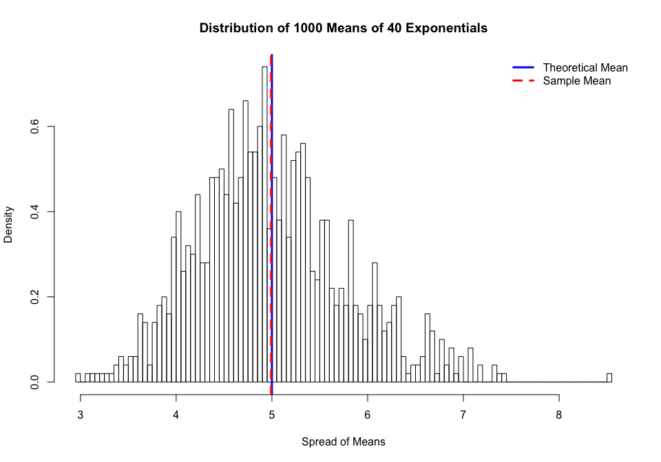
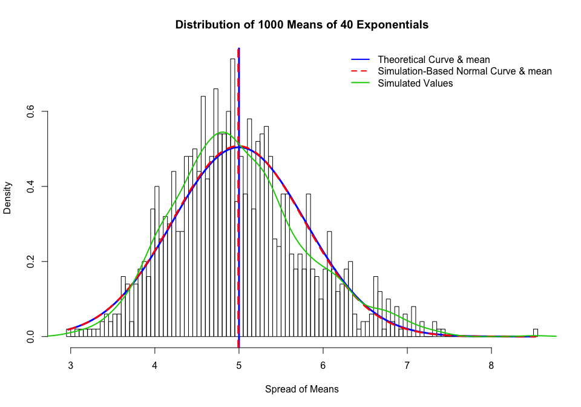
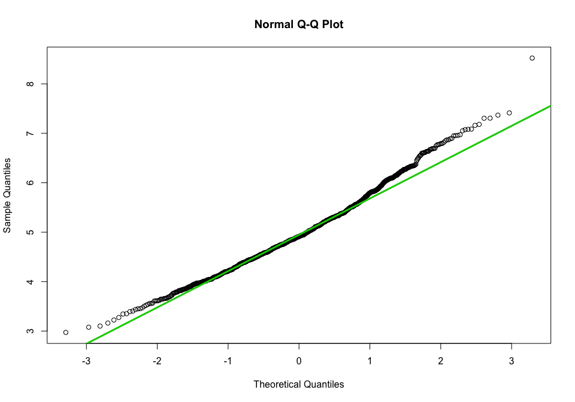

# Statistical Inference Project Report Part 1

Completed by: Samantha Kwah

## Part 1 : A Simulation Exercise

Investigate the exponential distribution in R and compare it with the Central Limit Theorem. The exponential distribution can be simulated in R with rexp(n, lambda) where lambda is the rate parameter. The mean of exponential distribution is 1/lambda and the standard deviation is also 1/lambda. 

Set lambda = 0.2 for all of the simulations. 


You will investigate the distribution of averages of 40 exponentials. Note that you will need to do a thousand simulations.

Illustrate via simulation and associated explanatory text the properties of the distribution of the mean of 40 exponentials. 


### 1. Sample mean Vs Theoretical mean 
Here, we  analyze the sample mean and compere it to the theoretical mean of the distribution.


Load necessary libraries 

```r
library(ggplot2)
#options(scipen=999)
```
Set more variables and settings

```r
# Number of simulations
Nsimulations <- 1000
# Number of exponentials
Nexp <- 40
# Set lambda 
lambda <- 0.2
# set seed to make random numbers reproducible
set.seed(25000000)
```


Theoretical Mean

```r
MeanTheory <- 1/lambda
```


Sample Mean

```r
mns <- NULL
for (i in 1 : Nsimulations) mns <- c(mns, mean(rexp(Nexp,lambda)))

# Create a matrix of 1000 rows with the columns corresponding to random simulation 40 times
#MatrixSim <- matrix(rexp(Nexp*Nsimulations, rate=lambda), Nsimulations, Nexp) 
# Find the Sample Mean
#mns <- rowMeans(MatrixSim)

#mns <- data.frame(ncol=2,nrow=1000)
#names(mns) <- c("Index","Mean")
#for (i in 1:Nsimulations)
#            {
#                      mns[i,1] <- i
#                      mns[i,2] <-  mean(rexp(Nexp,lambda))
#            }
MeanSample <- mean(mns)
```

Histogram Plot of Sample Means

```r
hist(mns, 
     breaks = 100,
     prob = TRUE,
     main="Distribution of 1000 Means of 40 Exponentials",
     xlab="Spread of Means")
abline(v = MeanTheory, 
       col= 4,
       lwd = 3)
abline(v = MeanSample, 
       col = 2,
       lwd = 3,
       lty= 2)
legend('topright', 
      c("Theoretical Mean", "Sample Mean"), 
      bty = "n", 
      lwd =c(3, 3),
      lty = c(1,2), 
      col = c(4,2)
      )
```

<!-- -->


The mean of distribution based on simulations is 4.9914522 and is close to the theoretical value of 5 for lambda = 0.2. 


### 2. Sample Variance Vs Theoretical Variance
Show how variable the sample is (via variance) and compare it to the theoretical variance of the distribution.

```r
VarSample <- var(mns)
VarTheory <- (1/lambda)^2/Nexp
```
The theoretical variance is 0.625, whereas the variance of the means is 0.6173536


### 3. Show that the distribution is approximately normal.

The sample means follow normal distribution because of the Central Limit Theorem.

 


```r
hist(mns, 
     breaks = 100, 
     prob = TRUE, 
     main="Distribution of 1000 Means of 40 Exponentials",
     xlab="Spread of Means")
abline(v = MeanTheory, 
       col= 4,
       lwd = 3)
abline(v = MeanSample, 
       col = 2,
       lwd = 3,
       lty= 2)

#TheoreticalCurve
xfit <- seq(min(mns), max(mns), length = 100)
yfit <- dnorm(xfit, mean = MeanTheory, sd = sqrt(VarTheory))
lines(xfit, yfit, pch = 22, col = 4, lty = 1, lwd = 3)
#Simulation Based Theoretical Curve
xfitS <- seq(min(mns), max(mns), length = 100)
yfitS <- dnorm(xfitS, mean = MeanSample, sd = sqrt(VarSample))
lines(xfitS, yfitS, pch = 22, col = 2,lty = 2,  lwd = 3)
#SimulatedCurve
lines(density(mns), pch = 22, col = 3,lty = 1, lwd = 2)
legend('topright', 
       c("Theoretical Curve & mean","Simulation-Based Normal Curve & mean","Simulated Values"),  
       bty = "n",
       
       lty = c(1,2,1),
       lwd = c(2,2,2),  
       col = c(4,2,3))
```

<!-- -->


The first figure above shows the superposition of distribution curves using the normal density plotted with theoretical and variance values. The Sample Curve approximates a normal distribution.

The blue Theoretical Curve is based on the theoretical mean and variance of 5 and 0.625 respectivaly. The red Simulation-Based Normal Curve is based on the simulation mean and variance of 4.9914522 and 0.6173536 respectively. The green Simulation Curve is simply based on actual simulation values converted to density.


Alternatively a q-q plot can be used to gauge the normality. The theoretical quantiles again match closely with the actual quantiles, proving that the sample distribution is approximately normal.


```r
qqnorm(mns, 
       main ="Normal Q-Q Plot")
       qqline(mns, 
       col = "3", lwd = 3)
```

<!-- -->

                            
