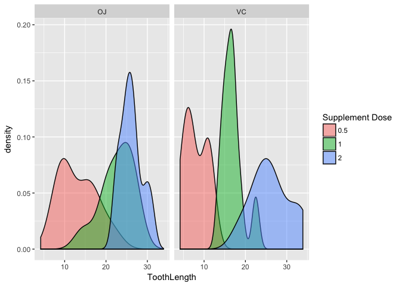
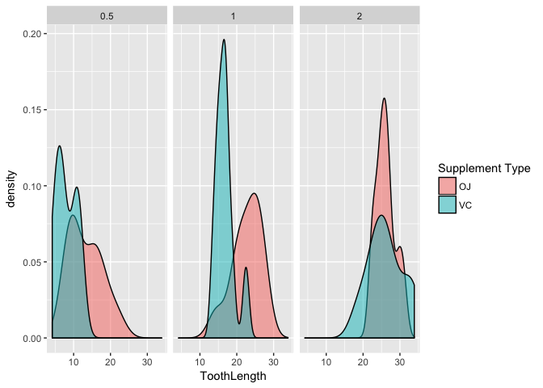

# Statistical Inference Project Report Part 2

Completed by: Samantha Kwah


## Part 2: Basic Inferential Data Analysis 
Now in the second portion of the project, we're going to analyze the ToothGrowth data in the R datasets package.

### 1. Load the ToothGrowth data and perform some basic exploratory data analyses
Load Libraries and data

```r
library(plyr)
library(ggplot2)
library(datasets)
library(grid)

data(ToothGrowth)
Tooth <- data.frame(ToothGrowth)
```


### 2. Provide a basic summary of the data.
Take a peek at the data

```r
# Convert suppllement and dose to factors
Tooth$supp <- factor(Tooth$supp)
Tooth$dose <- factor(Tooth$dose)
colnames(Tooth)<- c("ToothLength", "SupplementType", "Dose")
dim(Tooth)
```

```
## [1] 60  3
```

```r
head(Tooth)
```

```
##   ToothLength SupplementType Dose
## 1         4.2             VC  0.5
## 2        11.5             VC  0.5
## 3         7.3             VC  0.5
## 4         5.8             VC  0.5
## 5         6.4             VC  0.5
## 6        10.0             VC  0.5
```

Tooth is a data frame with 60 observations on 3 variables. It looks at the length of teeth in each of 10 guinea pigs at each of 3 dose levels of Vitamin C (0.5,1 and 2 mg) with either of 2 methods (orange juice "OJ" or ascorbic acid "VC")


Next is summarizing data with some graphics

```r
p1 <- ggplot(Tooth, aes(x=ToothLength, fill=Dose)) + geom_density(alpha = 0.5) + facet_grid(. ~ SupplementType) + xlab("ToothLength")  + guides(fill=guide_legend(title="Supplement Dose"))


print(p1)
```

<!-- -->

Figure 1 : Data with supplement type stratification

From the figure, we may guess that for both supplement types OJ and VC, higher doses lead to greater toothlength. This can be seen in the obvious shift of each dose curves to greater Toothlengths as dose increases.

As for the effect of supplement type on toothgrowth, there isn't an obvious pattern that may suggests one supplement type has greater efficacy over the other. Based on the areas under the curve, each corresponding dose has about the same curve area for each supplement type (e.g OJ pink curve area seems almost equivalent to the pink curve of VC). As such, an in-depth statical testing is needed to verify this.


```r
p2 <- ggplot(Tooth, aes(x=ToothLength, fill=SupplementType)) + geom_density(alpha = 0.5) + facet_grid(. ~ Dose) + xlab("ToothLength")  + guides(fill=guide_legend(title="Supplement Type"))


print(p2)
```

<!-- -->

Figure 2 : Data with Dose stratification

From the figure, it seems that at lower doses(0.5mg and 1mg) the difference in efficacy of supplement types is more distinct. At 2mg dose, OJ and VC supplement types may be almost similar in performance. However, greater in-depth statical testing is needed to verify this.

### 3. Use confidence intervals and/or hypothesis tests to compare tooth growth by supp and dose. 


#### Test 1 : Do Supplement Type impact on Tooth Growth, independent of Dosages?

We carry out two-sample (OJ vs. VC) T-tests. The null hypothesis is there is no difference in the effect of Supplement Type on tooth lengths. Using t.test, we check if there's difference in the type of treatments.


```r
t1 <- t.test(ToothLength ~ SupplementType, paired=F, var.equal=F, data=Tooth)
t1Summary <- data.frame("p-value"=c(t1$p.value),"CI-Lower"=c(t1$conf[1]), "CI-Upper"=c(t1$conf[2]), 
     row.names=c("OJ vs. VC:  "))
round(t1Summary,4)
```

```
##              p.value CI.Lower CI.Upper
## OJ vs. VC:    0.0606   -0.171    7.571
```

As the p-value of this test is 0.06 (>0.05) and there is a zero in 95 percent confidence interval, we cannot reject the null hypothesis and the supplement types seem to have no impact on tooth growth

#### Test 2 : Do Dosages affect Tooth Growth?
This requires 3 comparisons:

* 0.5 to 1;  
* 0.5 to 2; 
* 1 to 2

The null hypothesis is there is no difference in the performance of Doses on tooth lengths


```r
Tooth1<- subset(Tooth, Tooth$Dose==0.5)
Tooth2<- subset(Tooth, Tooth$Dose==1)
Tooth3<- subset(Tooth, Tooth$Dose==2)

test1v2<- t.test(Tooth1$ToothLength, Tooth2$ToothLength, paired=F, var.equal=F)
test1v3<- t.test(Tooth1$ToothLength, Tooth3$ToothLength, paired=F, var.equal=F)
test2v3<- t.test(Tooth2$ToothLength, Tooth3$ToothLength, paired=F, var.equal=F)

t2Summary <- data.frame("p-value"=c(test1v2$p.value,test1v3$p.value,test2v3$p.value), 
     "CI-Lower"=c(test1v2$conf[1],test1v3$conf[1],test2v3$conf[1]),
     "CI-Upper"=c(test1v2$conf[2],test1v3$conf[2],test2v3$conf[2]),
     row.names=c("0.5mg vs 1mg: ", "0.5mg vs 2mg: ","1mg vs 2mg: "))

round(t2Summary, 18)
```

```
##                     p.value   CI.Lower   CI.Upper
## 0.5mg vs 1mg:  1.268301e-07 -11.983781  -6.276219
## 0.5mg vs 2mg:  4.397500e-14 -18.156167 -12.833833
## 1mg vs 2mg:    1.906430e-05  -8.996481  -3.733519
```

The p values are very low (lower than 0.05) and the confidence intervals do not contain 0. We can reject the null hypothesis and attribute the the increment in tooth lengths to the increments in doses. 


#### Test 3 : Do Supplement Type impact on Tooth Growth, with stratification according to doses?

From figure 2, there might be potential differences in performance of different supplement types if compared within the same dosing groups. Let’s look within the groups just to check. 

Null Hypothesis within each dose groups is no difference in performance of supplement types on tooth lengths. 


```r
Tooth4 <- t.test(ToothLength~SupplementType, paired=F, var.equal=F, data=Tooth1)
Tooth5 <- t.test(ToothLength~SupplementType, paired=F, var.equal=F, data=Tooth2)
Tooth6 <- t.test(ToothLength~SupplementType, paired=F, var.equal=F, data=Tooth3)

t3Summary <- data.frame("p-value"=c(Tooth4$p.value,Tooth5$p.value,Tooth6$p.value), 
     "CI-Lower"=c(Tooth4$conf[1],Tooth5$conf[1],Tooth6$conf[1]),
     "CI-Upper"=c(Tooth4$conf[2],Tooth5$conf[2],Tooth6$conf[2]),
     row.names=c("0.5mg OJ vs. VC: ", "1mg OJ vs. VC: ","2mg OJ vs. VC: "))

round(t3Summary, 18)
```

```
##                       p.value  CI.Lower CI.Upper
## 0.5mg OJ vs. VC:  0.006358607  1.719057 8.780943
## 1mg OJ vs. VC:    0.001038376  2.802148 9.057852
## 2mg OJ vs. VC:    0.963851589 -3.798070 3.638070
```

A low p-value of 0.006 and 0.001 respectively was obtained for 0.5 mg and 1mg doses. Moreover, both confidence intervals did not contain zero. So we can reject the null hypothesis and conclude that in these dosing groups, OJ supplement type is better.

For 2mg, the p value is greater than 0.05 and confidence interval contain a zero. We cannot reject the null hypothesis here and both types of supplement can be used. 

#### 4a Assumptions


1. The sample sizes are small, so the t-test can be used 
2. We shall assume that variances are not equal, so R would calculate the variance to be applied in the t test.


#### 4b Conclusions

Test Summary -

1. From Test 1:

The null hypothesis is there is no difference in the effect of Supplement Type on tooth lengths. As the p-value of this test is 0.06 (>0.05) and there is a zero in 95 percent confidence interval, we cannot reject the null hypothesis and the supplement types seem to have no impact on tooth growth

2. From Test 2:

The null hypothesis is there is no difference in the performance of Doses on tooth lengths. The p values are very low (lower than 0.05) and the confidence intervals do not contain 0. We can reject the null hypothesis and attribute the the increment in tooth lengths to the increments in doses. 

3. From Test 3:

Null Hypothesis within each dose groups is no difference in performance of supplement types on tooth lengths. A low p-value of 0.006 and 0.001 respectively was obtained for 0.5 mg and 1mg doses. Moreover, both confidence intervals did not contain zero. So we can reject the null hypothesis and conclude that in these dosing groups, OJ supplement type is better. For 2mg, the p value is greater than 0.05 and confidence interval contain a zero. We cannot reject the null hypothesis here and both types of supplement can be used. 

====================================================================================

Conclusions -
To achieve a faster growth in tooth lengths, we can use either supplement types (OJ or VC) at high doses (2mg). However if situations necessitate a lower dosing requirement(e.g collateral effects on other physiological aspect), we would recomment using OJ instead of VC, as it gives greater tooth growth for the same dosing requirments.

However further tests need to be done to measure accurately the amount of vitamin C in each supplement type. OJ may reach greater performance due to higher concentrations of Vitamin C it contains. Data collection of vitamin C concentration that can be extracted per fixed volume of supplement may be important for further data normalisation. Data normalisation can be used to verify the aforementioned conclusions. 


